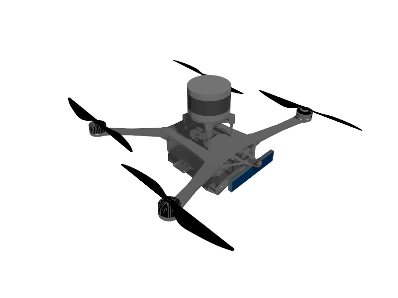

# COSTAR Shafter Sensor Config 1
This package contains a virtual model for the COSTAR Shafter aerial platform. Please see the [specifications.md](specifications.md) file for more information.

## Description
The Shafter aerial platform is an autonomous system capable of being deployed in an unknown environment. In this configuration, the platform is equipped with the following sensors: 3D LIDAR, forward facing RGBD camera and an IMU.

[](thumbnails/1.png)

## Usage Instructions
To launch the aerial platform in the simulation environment use the following commands:
```
cd (path to package)/launch
ign launch -v 4 example.ign robotName:=shafter modelName:=costar_shafter_sensor_config_1
```

The robot can be controlled by sending Twist commands to the vehicle_name/cmd_vel ROS topic.

## Usage Rights
No additional restrictions have to be taken into account for this configuration.


