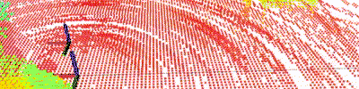
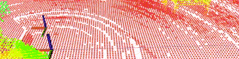

# CTU-CRAS-NORLAB-X500
This repository contains a virtual model of the X500 aerial platform of the CTU-CRAS-NORLAB team. Please see the [specifications](specifications.md) for more information.

## Description
X500 is a quadrotor UAV based on the Holybro X500 frame built for the Final Circuit of the DARPA Subterranean Challenge.
Its sensory equipment consisting of 3D LiDAR, 2 RGBD cameras and 1 RGB camera allows reliable navigation through various environments, its small size facilitates flying through narrow passages.
A two-battery system consisting of 2 Lipo 6750mAh 4-cell batteries connected in parallel can power the UAV for over 25 minutes of flight time.
The propulsion system consists of T-MOTOR MN3510 KV700 motors and 13 inch propellers.

## Usage Instructions
The robot motion is controlled via standard cmd_vel commands.

## Usage Rights
No additional restrictions have to be taken into account for this configuration.

## MRS multirotor controller

* The code is based on the [multicopter_control](https://github.com/ignitionrobotics/ign-gazebo/tree/ign-gazebo4/src/systems/multicopter_control) plugin from the [ignitionrobotics/ign-gazebo](https://github.com/ignitionrobotics/ign-gazebo).
* The controller is based on the original work off [Lee, 2010](https://ieeexplore.ieee.org/iel5/5707200/5716927/05717652.pdf).
* The controller's interface is compatible with [multicopter_control](https://github.com/ignitionrobotics/ign-gazebo/tree/ign-gazebo4/src/systems/multicopter_control), therefore, it can be swapped without the need to modify loading of its parameters.
* This controller was forked due to the lack of specifying a feedforward action, which is vital for precise UAV control [(link)](https://arxiv.org/abs/2008.08050). Controlling the UAV only through the desired velocity limits the available dynamics significantly.

|                              |                            |
|------------------------------|----------------------------|
| Control without feed forward |  |
| Control with feed forward    |     |

### Input

As the [original controller](https://github.com/ignitionrobotics/ign-gazebo/tree/ign-gazebo4/src/systems/multicopter_control), the MRS controller accepts the **geometry_msgs/Twist** command.
The twist command contains desired linear velocities in the body frame of the UAV and the desired yaw rate.
The control response of this controller should be identical as the response of the original controller.

A new **optional** input is introduced, allowing users to set desired feedforward **acceleration** and **jerk**.
When provided, the acceleration feedforward component is added to the desired force vector produced by the original velocity feedback.
The jerk feedforward component is used to generate an appropriate desired attitude rate feedforward action.
Both components can be provided in the form of ROS **geometry_msgs/Twist** message on the topic
```
/mrs_multirotor_controller/<ROBOT NAME>/feedforward
```
with the **geometry_msgs/Twist/linear** representing the desired acceleration, and **geometry_msgs/Twist/angular** representing the desired jerk.
Both component are supposed to be supplied in the body frame of the UAV, similarly to the desired velocity.

### Constraining the UAV dynamics

The original acceleration saturation is applied to the sum of the result of the velocity feedback (as it was originally) and the feedforward acceleration reference.
The desired jerk feedforward is left unconstrained.

### Parameters

The form and the function of the controller's paramaters was left unchanged from the [original controller](https://github.com/ignitionrobotics/ign-gazebo/tree/ign-gazebo4/src/systems/multicopter_control).

### Disclaimer

The software is provided "as is" without any guarantees.
The sofware was not developed nor is it suited for control of real-world robots.
The software lacks safety features that should be employed in real world to mitigate abnormal situations and special cases during its execution!
If you are interesting in controlling a real-world multirotor helicopter, please get inspiration, e.g., in the [mrs_uav_controllers](https://github.com/ctu-mrs/mrs_uav_controllers) and [mrs_uav_system](https://github.com/ctu-mrs/mrs_uav_system) packages.
